# Phrase Lens

中文文档：[README_zh.md](README_zh.md)

Phrase Lens is a local-first English-learning app. Paste an English paragraph, click `分析短语`, and it highlights:

- Red: useful phrases, terms, and collocations worth memorizing.
- Green: grammar, sentence structure, and logic connectors.

The current app uses `pnpm`, Vite, React, TypeScript, Mantine, and lucide icons. It keeps parsing and library logic in reusable domain modules so browser extensions, Raycast, and future iOS surfaces can share the same data model.

## Current Features

- Paste English and highlight useful phrases and sentence structures.
- Save the current reading session into a local library.
- Save copied notes as portable memories.
- Keep a local wordbook in browser storage.
- Add or edit a Chinese translation for every sentence without leaving the local app.
- Export the library as JSON, Markdown, or CSV.
- Import a JSON library backup and merge it with local data.

## Product Flow

```mermaid
%%{init: {'theme':'base','themeVariables':{'fontFamily':'Inter, ui-sans-serif, system-ui','lineColor':'#94a3b8','primaryTextColor':'#17211d'}}}%%
flowchart LR
  Capture["Paste English"] --> Analyze["Analyze phrases"]
  Analyze --> Read["Read red and green highlights"]
  Read --> Translate["Add Chinese translation"]
  Translate --> Save["Save to local library"]
  Save --> Export["Export portable files"]
  Export --> Sync["Move or back up with iCloud Drive"]

  classDef capture fill:#fff7ed,stroke:#f97316,color:#9a3412,stroke-width:2px
  classDef analyze fill:#eff6ff,stroke:#3b82f6,color:#1e3a8a,stroke-width:2px
  classDef read fill:#f0fdf4,stroke:#22c55e,color:#166534,stroke-width:2px
  classDef translate fill:#fdf2f8,stroke:#ec4899,color:#9d174d,stroke-width:2px
  classDef save fill:#ecfeff,stroke:#06b6d4,color:#155e75,stroke-width:2px
  classDef export fill:#fefce8,stroke:#eab308,color:#854d0e,stroke-width:2px
  classDef sync fill:#f1f5f9,stroke:#64748b,color:#334155,stroke-width:2px

  class Capture capture
  class Analyze analyze
  class Read read
  class Translate translate
  class Save save
  class Export export
  class Sync sync
  linkStyle default stroke:#94a3b8,stroke-width:2px
```



Translations are editable local data. Phrase Lens does not require a translation API for the core reading and memory loop.

## Product Direction

Phrase Lens is local-first. The user's wordbook, copied memories, and reading sessions must remain portable files that can be backed up, inspected, imported, exported, and moved between surfaces.

If sync is needed, the preferred cloud layer is Apple iCloud Drive. Phrase Lens should treat iCloud as a user-owned file sync location, not as a proprietary backend.

See [docs/product-spec.md](docs/product-spec.md).

## Run

```bash
pnpm install
pnpm run dev
```

Open the Vite URL printed by the terminal, usually <http://127.0.0.1:5173/>.

## Scripts

```bash
pnpm run dev
pnpm run typecheck
pnpm run build
```

## Structure

```text
src/
  components/        Mantine UI panels
  data/              sample text, phrase rules, sample translations
  domain/            parser and portable library model
  services/          browser storage adapter
  utils/             export/download helpers
```

## Next Useful Upgrade

Add import/export for the local library format first. After that, optionally add an AI parser that sends the current text only when the user explicitly asks for parsing and returns structured JSON:

```json
{
  "sentences": [
    {
      "source": "English sentence",
      "translation": "中文译文",
      "marks": [
        {
          "text": "optimize for",
          "color": "red",
          "meaning": "针对……优化"
        }
      ]
    }
  ]
}
```
